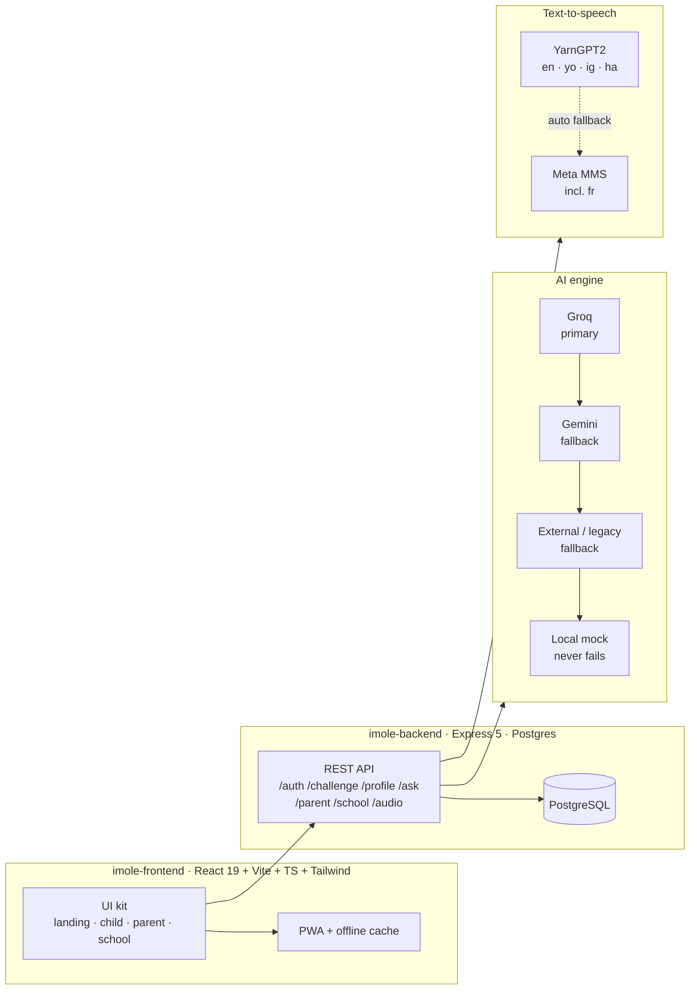

# Imole-ai ⛅

**Be the Light** — an AI life-skills coach for Nigerian children.

> AI life-skills coach for Nigerian children aged 8-16 — daily challenges, safe chat and voice, in 6 languages.

Built for the **Teach in Tech (TiT) 6.0** hackathon — EdTech track.

---

## The problem

Nigerian kids rarely get personalized, culturally relevant life-skills coaching.
Most edtech is:

- **Exam-focused** — built to pass tests, not to grow confident, capable humans.
- **English-only** — a barrier for the majority of children who learn and live in Yoruba, Hausa, Igbo, Pidgin or French.
- **Not personalized** — one-size-fits-all content that ignores each child's age, language and level.

Money skills, speaking up, kindness, creative thinking and mental maths are caught,
not taught — and too often, never taught at all.

## The solution

**Imole** ("light" in Yoruba) delivers **one fresh daily challenge per child**, in
their language and at their level, plus a safe AI chat, text-to-speech, streaks and
a parent dashboard.

- 🌞 **One daily challenge** — a concrete, doable action with things around them, matched to their skill and language.
- 💬 **Ask-Imole chat** — a safe, kid-friendly AI coach they can ask anything.
- 🔊 **Voice** — text-to-speech and speech input across all 6 languages.
- 🔥 **Streaks & rewards** — momentum, milestones and fun.
- 👨‍👩‍👧 **Parent dashboard** — see progress, streaks and skill growth at a glance.
- 🗣️ **6 languages** — English, Yoruba, Hausa, Igbo, French and Nigerian Pidgin.

## Architecture



**Data flows**

1. The child opens Imole → `GET /challenge/daily` picks the skill for the day (rotates daily) and generates a fresh challenge via the AI engine.
2. The AI engine tries **Groq**, falls back to **Gemini**, then to a legacy endpoint, and finally to a **local mock** — the demo never breaks, even with no API keys or no network.
3. The child answers → `POST /challenge/:id/submit` scores the answer, updates the streak and saves the response.
4. Chat, TTS and parent reports all follow the same resilient fallback pattern.

## Design system

A complete, reusable design system lives in
**[`docs/design-system.md`](docs/design-system.md)** — colors, type scale, spacing,
radii, motion and component specs.

Design tokens are **Yoruba-light themed**: light `bg-base` screens, deep navy
headings, and warm **cream, orange and cyan** accents.

```css
:root {
  --color-bg-base:        rgb(246 249 255); /* page canvas  */
  --color-bg-card:        rgb(255 255 255); /* cards         */
  --color-text-primary:   rgb(0 36 68);     /* navy headings */
  --color-accent:         rgb(0 36 68);     /* primary navy  */
  --color-orange:           rgb(255 138 0);  /* Imole glow    */
  --color-cyan:           rgb(0 206 222);   /* cool accent   */
  --color-streak:         rgb(255 138 0);   /* streak fire   */
}
```

The **UI kit** — every component rendered on one page — lives at
**[`ui-kit/index.html`](ui-kit/index.html)**. Open it in a browser to browse
buttons, cards, badges, inputs, avatars, toasts, stat cards and more.

## Roadmap

- [ ] Daily challenge engine (AI-generated, per-child, per-language)
- [ ] Ask-Imole safe chat with streaming + memory
- [ ] Voice — text-to-speech
- [ ] Parent dashboard with 30-day progress charts
- [ ] Leaderboard with anonymous ranks
- [ ] Offline-first PWA (cached challenges, cached TTS)

## Setup

### Prerequisites

- Node.js 20+
- pnpm (or npm/yarn)

### Clone & install

```bash
git clone https://github.com/<your-username>/imole.git
cd imole

# Frontend
cd imole-frontend
pnpm install
pnpm run dev            # http://localhost:5173

# Backend (in a second terminal)
cd ../imole-backend
pnpm install
cp .env.example .env    # add keys you have; none are required
pnpm run dev            # http://localhost:3001
```

### Environment variables

| Variable              | Required | Default               | Purpose                                  |
| --------------------- | :------: | --------------------- | ---------------------------------------- |
| `PORT`                |    no    | `3001`                | Backend port                             |
| `DATABASE_URL`        |   yes*   | —                     | PostgreSQL connection string             |
| `GROQ_API_KEY`        |    no    | —                     | Primary AI provider (Groq)               |
| `GROQ_MODEL`          |    no    | `openai/gpt-oss-20b`  | Groq model id                            |
| `GEMINI_API_KEY`      |    no    | —                     | Fallback AI provider (Gemini)            |
| `GEMINI_MODEL`        |    no    | `gemini-3.6-flash`    | Gemini model id                          |
| `AI_SERVICE_URL`      |    no    | —                     | Legacy external AI endpoint              |
| `YARNGPT_API_KEY`     |    no    | —                     | TTS provider for en/yo/ig/ha             |
| `TTS_PROVIDER`        |    no    | `auto`                | `auto` \| `yarngpt2` \| `mms`            |
| `GEMINI_EMBED_MODEL`  |    no    | `auto`                |  Vector embeddings            |


## License

[MIT](LICENSE) © Imole-ai

---

> TiT 6.0 · EdTech · "Be the Light" ⛅